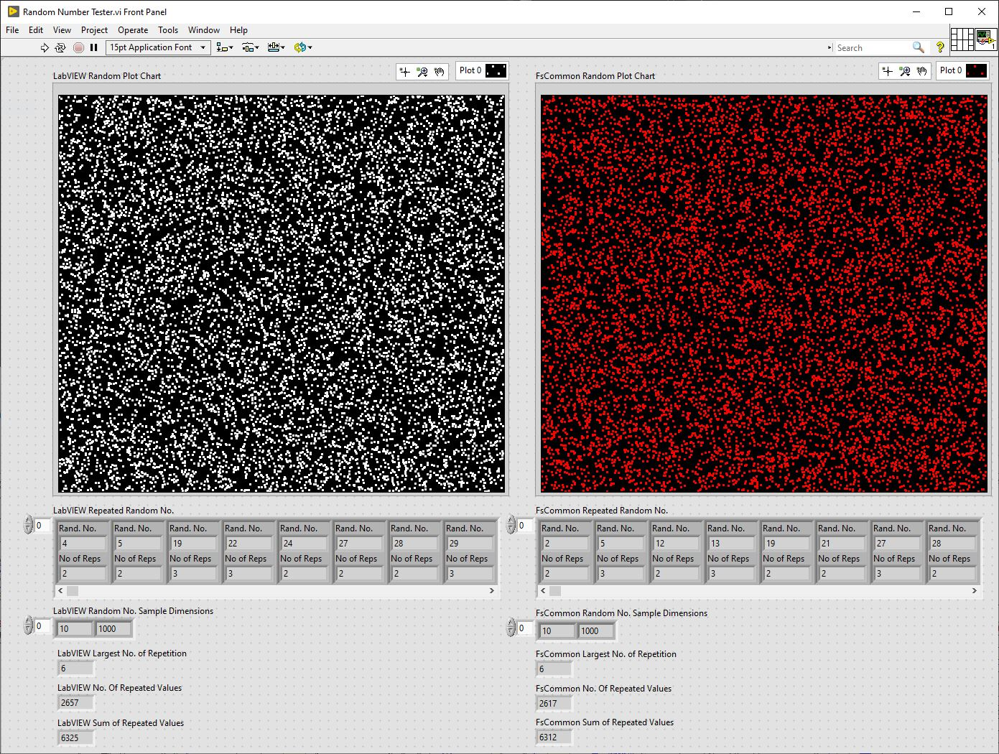
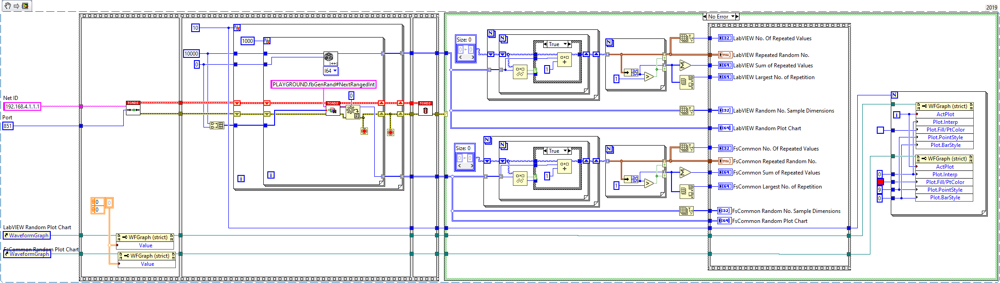

# FisoThemes' Common Library for TwinCAT

## Overview

A library for providing a set of common utilities and definitions that streamline and standardise the development of PLC applications. The library offers a set of reusable components that simplify everyday tasks and ensure consistency across projects.

## Features

- **Memory Management Utilities**: Functions for dynamic and static memory management, ensuring efficient memory usage and safety.
- **Hashing Functions**: Efficient hashing functions for data integrity and change detection.
- **Type Aliases**: Predefined type aliases for common data types to simplify code readability and maintenance.
- **Type Limits**: Constants defining the limits of various data types, helping to enforce value constraints and prevent errors.
- **Task Information Interfaces**: Interfaces and function blocks for retrieving and managing PLC task information, including detecting PLC cycle changes.
- **Processor Architecture Information**: Easy access to processor architecture details.
- **Value Change Detection**: Function blocks for detecting changes in variable values, enabling responsive and adaptive control logic.
- **Flag Resetting**: Functions for resetting boolean values, useful for state management in PLC programs.
- **Cycle Time Monitoring**: Tools for monitoring and responding to PLC cycle times, ensuring timely execution of control logic.
- **Random Number Generation**: A fast and memory-efficient function block for generating random integers and real numbers, including ranged random numbers.
- **Decimal Places Setting**: Rounding of real values to a specified number of decimal places.


## Usage

### Example: Memory Management

```js
VAR
    pDynamicMemory : POINTER TO BYTE;
END_VAR

// Allocate 100 bytes of memory
pDynamicMemory := F_AllocateMemory(100);

// Checks if the memory is in stack or heap and then deallocates memory
F_DeallocateMemory(pDynamicMemory);
```

### Example: Value Change Detection

```js
VAR
    fbValueChangeDetector   : FB_ValueChangeDetector;
    bValueChanged           : BOOL;
    nValue                  : INT;
END_VAR

// Value to watch for change
fbValueChangeDetector(Value := nValue);

// Check if the value has changed
IF fbValueChangeDetector.HasChanged THEN
    // Handle the value change
END_IF
```

### Example: PLC Task Information

```js
VAR
    nCycleCount     : UDINT;
    tCycleTime,
    tLastExecTime   : LTIME;
END_VAR

// Get the cycle count of the current task
nCycleCount     := F_GetCurrentPlcTaskInformation().CycleCount;

// Get the task cycle time
tCycleTime      := F_GetCurrentPlcTaskInformation().CycleTime

// Get the execution time of the last cycle
tLastExecTime   := F_GetCurrentPlcTaskInformation().LastCycleExecutionTime;
```

### Example: Random Number Generation
```js
VAR
    fbGenRand       : FB_RandomNumberGenerator(0); // FB_RandomNumberGenerator(<seed>)
    nRand1, nRand2  : LINT;
    fRand1, fRand2  : LREAL;
END_VAR

// Generate random integers and real numbers
nRand1 := fbGenRand.NextInt();
nRand2 := fbGenRand.NextRangedInt(-10, 100);
fRand1 := fbGenRand.NextReal();
fRand2 := fbGenRand.NextRangedReal(5.8, 8.92);
```
#### Comparison with LabVIEW's Random Number Generator





### Example: PLC Task Cycle Change Detection

```js
METHOD DoSomething : BOOL
VAR_INST
    fbTaskCycleChanged : FB_PlcTaskCycleChangeDetector(1); // FB_PlcTaskCycleChangeDetector(<Task Index>)
END_VAR

// Check if the task cycle has changed
IF fbTaskCycleChanged.HasChanged THEN
    // Handle the task cycle change
END_IF
...
END_METHOD
```

### Example: Setting Decimal Places and Rounding.

```js
VAR
    fOriginalValue  : LREAL := 123.456789;
    fRoundedValue   : LREAL;
    nDecimalPlaces  : USINT := 2;
END_VAR

fRoundedValue := F_RoundToDecimalPlaces(fOriginalValue, nDecimalPlaces);
// fRoundedValue will be 123.46
```

### Example: Get the name and type of the variable as a string
```js
VAR
    sVarName,
    sTypeName,
    sTypeNameByPath : STRING;
    stVariable      : ST_Variable;
END_VAR

// Output : 'stVariable'.
sVarName := F_ExtractVariableNameFromPath( F_GetVariablePath(stVariable) );
// Output : 'ST_Variable'.
sTypeName := F_GetTypeName(stVariable);
// Output : 'ST_Variable'.
sTypeNameByPath := 
    F_GetTypeNameByPath(
        F_GetVariablePathByAddress(ADR(stVariable), SIZEOF(stVariable)) );
```

### Example: Functions to get array bounds of common types
```js
VAR
    arValues : ARRAY[-22..GVL_TypeValueLimits.SINT_MAX] OF LREAL;
    nLower,
    nUpper   : T_Position;
END_VAR

nLower := F_GetLRealArrayLowerBound(arValues);
nUpper := F_GetLRealArrayUpperBound(arValues);
```

### Example: Pointer Safety and Analysis
Utilities to safely inspect and traverse pointers, preventing runtime exceptions during memory access.

- `F_IsReadablePointer`: Returns `TRUE` if the pointer addresses a valid, readable memory area (Static or Dynamic).
- `F_TryDerefPointer`: safely attempts to dereference a pointer chain up to `n` levels deep. Always returns the last readable pointer.
- `F_IsPointerToFunctionBlock`: (Heuristic) Checks if a pointer appears to point to a valid Function Block instance.
- `F_IsPointerToInterface`: (Heuristic) Checks if a pointer appears to point to an Interface.

> [!NOTE]
> 
> When using `F_IsPointerToInterface` and `F_IsPointerToFunctionBlock` make sure to implement `__SYSTEM.IQueryInterface` on your Function Block and Interface types.
> 

```js
VAR
    ...
    pUnknown : POINTER TO BYTE;
    pDeep    : POINTER TO POINTER TO BYTE;
    pResult  : POINTER TO BYTE;
    pObject  : POINTER TO FB_Object := ADR(fbMyObject);
END_VAR

// Check if pointer is pointing to valid memory.
IF F_IsReadablePointer(pUnknown) THEN
    // Safe to access pUnknown^
END_IF

// Safely dereference a pointer of unknown depth
// Returns last readable pointer
pResult := F_TryDerefPointer(pDeep, 2); 

// Heuristic check: Is this a Function Block?
IF F_IsPointerToFunctionBlock(pObject) THEN
   // Likely a valid FB instance
END_IF
```

### Example: Interface Introspection
Inspect the relationship between Interfaces and their underlying Function Blocks.

- `F_AreSameTypeFromInterfaces`: Checks if two different interface pointers actually originate from instances of the same concrete Function Block type.
- `F_ExtractPointerFromInterface`:

```js
VAR
    fbInstanceA, fbInstanceB : FB_MyObject;
    ipA         : I_MyInterface := fbInstanceA;
    ipB         : I_MyInterface := fbInstanceB;
    pInterface  : POINTER TO BYTE;
END_VAR

// Check if both interfaces come from the same FB type
IF F_AreSameTypeFromInterfaces(ipA, ipB) THEN
    // Validates that ipA and ipB refer to FBs of the same class
    // (Useful for safe casting or comparison logic)
END_IF

// Extract the raw pointer from the interface usually displayed in Online Mode.
pInterface := F_ExtractPointerFromInterface(ADR(ipA));
```

### Example: Runtime Type Identification
Efficiently identify and compare the concrete types of variables or Function Blocks without relying on slow string comparisons.

- `F_GetTypeID`: Retrieves a unique identifier (`T_TypeID`) for the variable's type. For Function Blocks, this returns the internal VTable pointer.
- `F_GetTypeIDFromGeneric`: Advanced variant handling `T_Generic` inputs.

```js
VAR
    fbInstanceA : FB_MyCustomBlock;
    fbInstanceB : FB_MyCustomBlock; // Same type as A
    fbInstanceC : FB_OtherBlock;    // Different type
END_VAR

// Check if two instances are of the exact same class
IF F_GetTypeID(fbInstanceA) = F_GetTypeID(fbInstanceB) THEN
    // TRUE: They are the same type
END_IF

IF F_GetTypeID(fbInstanceA) = F_GetTypeID(fbInstanceC) THEN
    // FALSE: They are different types
END_IF
```

> [!NOTE]
>
> `F_GetTypeID` and `F_GetTypeIDFromGeneric` rely on heuristics and may require a FB to implement `__SYSTEM.IQueryInterface` for reliable detection.
> 

## Developer Notes
This project is still in development. There's a lot of work and testing ahead. Changes to functionality may occur in the future.

This is designed to be part of a larger framework that is still under development.
